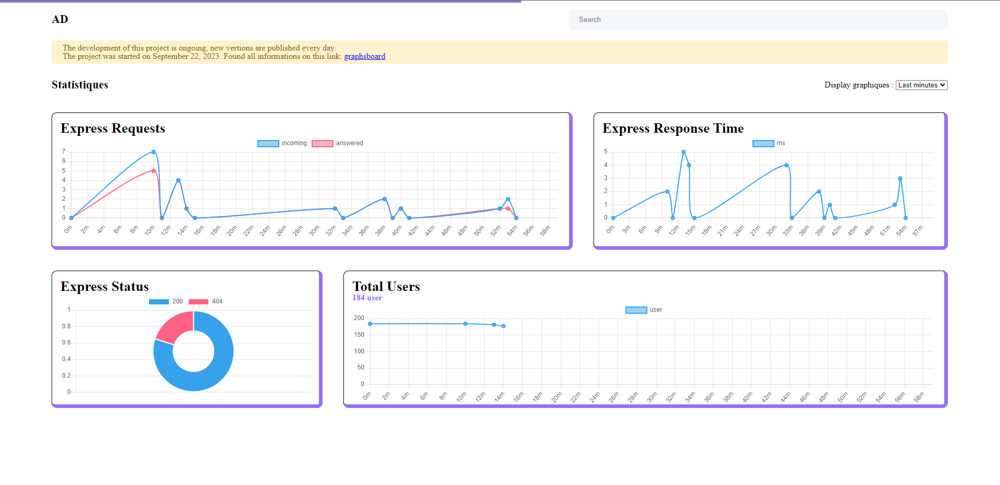

[](https://www.npmjs.com/package/graphsboard)
[](https://img.shields.io/npm/dt/graphsboard.svg)

## Development in progress
```
The development of this project is ongoing, new vertions are published every day.
```
<br/><br/>

Host your own dashboard and generate the graphics you want. You can also simply connect the extension to your express server to automatically generate server statistics.

## Web dashboard preview


## Installation & setup
1. Run 
```shell
    npm i graphsboard --save
```
2. If you don't use express
```javascript
    const graphsboard = require('graphsboard')
    graphsboard.server()
```
2. If you use express add middleware
```javascript
    const express = require("express")
    const app = express()

    // Add this line before all other middleware
    const graphsboard = require('graphsboard')
    app.use(graphsboard.middleware())

    app.listen(80, () => {
        console.log(`Express server is running : http://localhost/`)
    })
```
3. Visit http://ServerIP/graphsboard

Note: This plugin works on Node versions > 4.x

## Configuration
You can change the default configuration:
```javascript
    const config = {
        path: '/custom',
        ignorePaths: [ '/staff' ],
        port: 8080,
    }
    
    // Exemple 1
    graphsboard.server(config)
    // Exemple 2
    app.use(graphsboard.middleware(config))
```

Default config:
```javascript
    path: '/graphsboard',
    ignorePaths: [ '/public', '/admin' ],
    port: 80,

    expressGraph: true
```

Recovered Data:
- `path` : You can change the panel access path <br/>
- `ignorePaths` : If you use Express, you can disable statistics for certain requests <br/>
- `port` : You can change the server's exposure port <br/>
- `expressGraph` : Automatically generate graphs for Express (Total Request and average request response status) <br/>

## How to use
Simply add new graphics and data

```javascript
    const graphsboard = require('graphsboard')
    const graph = graphsboard.graph('Total Users', {
        type: 'line', // Default: 'line' - List : ['line', 'bar', 'polararea', 'doughnut', 'radar']
        absolute: true
    })
    graph.add({user: 1})
```
Graph options :
- `type`: Change graph display type
    - **default**: "line"
    - **options**: [ 'line', 'bar', 'polararea', 'doughnut', 'radar' ]
- `size`: Change the minimum width of the graphic on the page
    - **default**: 1
    - **options**: [ 1, 2, 3 ]
- `priority`: Change the order of your graphics. Enter a value between 1 and 100. Charts are sorted by increasing priority. If you use the default express graphics, they have a priority of 50.
- `absolute`: Does the value continue to increment infinitely? Or does it return to 0 every new minute?
    - **default**: false
- `avrg`: Calculate the average of inserted data
    - **Exemple**: Average query response time
- `min`: Set a minimum value for graph display
- `max`: Set a maximum value for graph display

## Manage data files
A graphsboard folder is automatically generated at the root of your project, with a .json file for each graph you generate. If you wish to delete a graphic, simply delete the .json file.